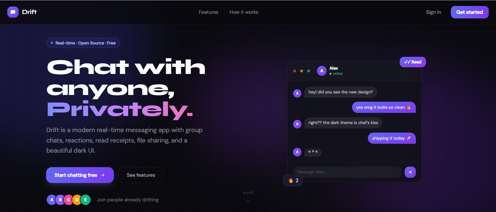
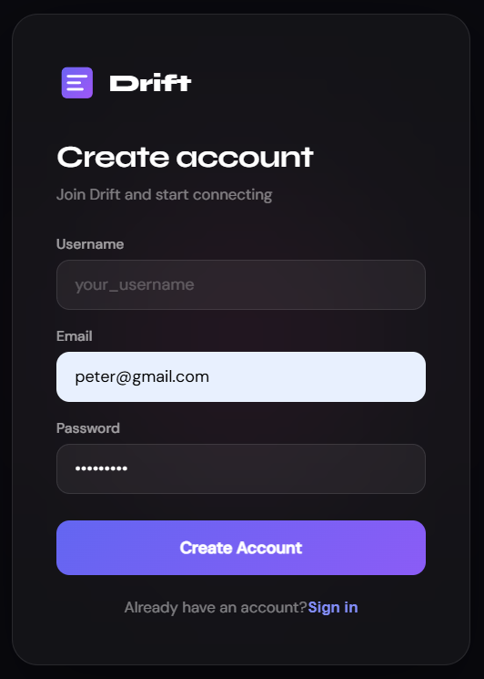
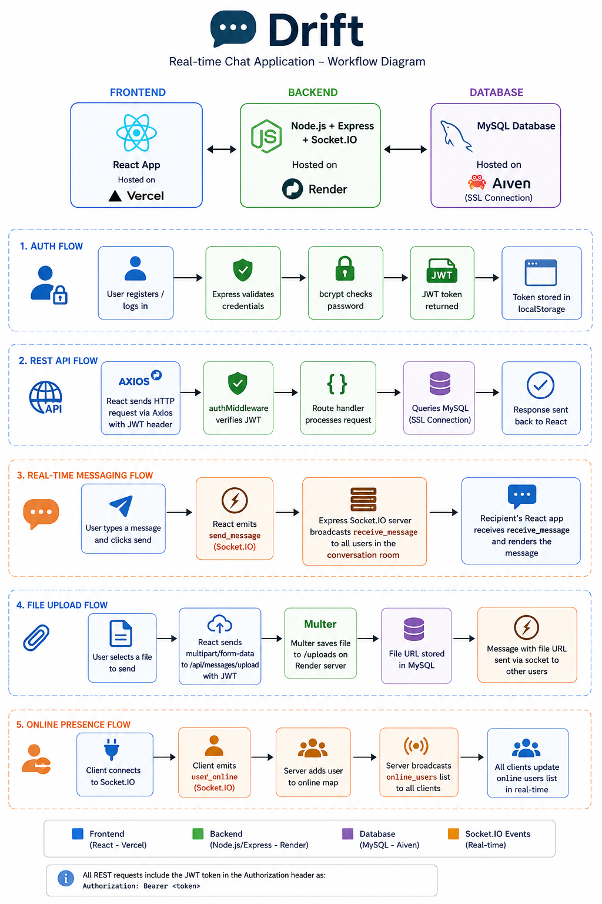

# Drift — Real-time Chat App

A full-stack real-time chat application built with React, Node.js/Express, MySQL, and Socket.IO.

**Live stack:** Vercel (frontend) · Render (backend) · Aiven (MySQL)

**Homepage:**






---

## Features

### 💬 Messaging
- **Real-time messaging** — Instant chat powered by Socket.IO, no refresh needed
- **Direct messages** — One-on-one private conversations
- **Group chats** — Create group conversations with multiple members
- **Message deletion** — Delete your own messages, shows "deleted" placeholder for others
- **Optimistic UI** — Messages appear instantly before server confirmation

### 🔔 Live Interaction
- **Typing indicators** — See a live animation when someone is typing
- **Online presence** — Green dot shows who's currently online
- **Read receipts** — Single ✓ for delivered, double ✓✓ when the other person has read it
- **Emoji reactions** — React to any message with 6 emoji options, toggle to remove
- **Reaction pop animation** — Emoji floats up when you react

### 📁 Media & Files
- **Image sharing** — Send photos directly in chat, click to open full size
- **File sharing** — Share PDFs, docs, and other files with a download link
- **Avatar upload** — Set a profile picture, stored and served from the backend

### 🔐 Auth & Security
- **JWT authentication** — Secure token-based login and registration
- **Protected routes** — All API endpoints require a valid token
- **Password hashing** — Passwords stored securely with bcrypt

### 🔍 Search & Navigation
- **User search** — Find any user by username or email to start a conversation
- **In-chat search** — Search through messages within a conversation
- **Conversation list** — Sorted by latest message with preview and timestamp

### 👤 Profiles
- **Profile page** — View your own or another user's profile
- **Editable profile** — Update your username, bio, and avatar in one place
- **Join date** — Shows when the account was created

### 📱 UI & Experience
- **Dark theme** — Sleek dark UI with a purple accent palette
- **Mobile responsive** — Fully usable on phones with slide-in sidebar
- **Smooth animations** — Messages animate in, modals scale in, reactions pop
- **Custom scrollbar** — Minimal styled scrollbar in the message area

---
## Project Architecture



## Tech Stack

### Frontend
| Technology | Purpose |
|------------|---------|
| React 18 | UI framework |
| React Context API | Auth and socket state management |
| Socket.IO Client | Real-time communication |
| Axios | HTTP requests |
| CSS (vanilla) | Styling — no UI library, fully custom |

### Backend
| Technology | Purpose |
|------------|---------|
| Node.js + Express | REST API server |
| Socket.IO | WebSocket server for real-time events |
| MySQL2 | Database driver |
| JWT (jsonwebtoken) | Authentication tokens |
| bcrypt | Password hashing |
| Multer | File and avatar uploads |

### Infrastructure
| Service | Role |
|---------|------|
| [Vercel](https://vercel.com) | Frontend hosting (CDN + auto-deploy) |
| [Render](https://render.com) | Backend hosting (Node.js web service) |
| [Aiven](https://aiven.io) | Managed MySQL database with SSL |

---

## Project Structure

```
chat-app/
├── backend/
│   ├── routes/
│   │   ├── auth.js             # Register / Login
│   │   ├── user.js             # Profile / Search / Avatar upload
│   │   ├── conversation.js     # DMs + Group conversations
│   │   └── message.js          # Send / Fetch / Delete / React / Upload
│   ├── middleware/
│   │   └── authMiddleware.js
│   ├── uploads/                # Uploaded avatars & files (persisted)
│   ├── db.js                   # MySQL pool with SSL (Aiven compatible)
│   ├── server.js               # Express + Socket.IO
│   ├── schema.sql              # Full MySQL schema
│   └── Dockerfile
│
├── frontend/
│   ├── src/
│   │   ├── api/axios.js
│   │   ├── context/
│   │   │   ├── AuthContext.jsx
│   │   │   └── SocketContext.jsx
│   │   ├── pages/
│   │   │   ├── AuthPage.jsx
│   │   │   ├── ChatPage.jsx
│   │   │   └── ProfilePage.jsx
│   │   ├── styles/
│   │   │   ├── auth.css
│   │   │   ├── chat.css
│   │   │   └── profile.css
│   │   ├── App.jsx
│   │   └── index.js
│   ├── public/index.html
│   ├── nginx.conf
│   └── Dockerfile
│
├── docker-compose.yml
└── .env.example
```

---

## Deployment Setup (Render + Vercel + Aiven)

This is the recommended production setup. No Docker needed.

### Step 1 — Aiven (MySQL Database)

1. Go to [aiven.io](https://aiven.io) and create a **MySQL** service (free tier works)
2. Once running, open the service and go to the **Overview** tab
3. Copy these values — you'll need them for the backend env:
   - **Host** → `DB_HOST`
   - **Port** → `DB_PORT`
   - **User** → `DB_USER`
   - **Password** → `DB_PASSWORD`
   - **Database** → `DB_NAME` (default is usually `defaultdb`)
4. Run the schema against your Aiven DB. You can use any MySQL client (TablePlus, DBeaver, or CLI):
   ```bash
   mysql -u <DB_USER> -p<DB_PASSWORD> -h <DB_HOST> -P <DB_PORT> --ssl-mode=REQUIRED < backend/schema.sql
   ```

> Aiven requires SSL. The `db.js` already handles this with `rejectUnauthorized: false`.

---

### Step 2 — Render (Backend)

1. Go to [render.com](https://render.com) → **New → Web Service**
2. Connect your GitHub repo and select the **`backend`** folder as root directory
   - **Build command:** `npm install`
   - **Start command:** `node server.js`
   - **Node version:** 18+
3. Add the following **Environment Variables** in Render dashboard:

```
PORT=5000
CLIENT_URL=https://your-vercel-app.vercel.app

DB_HOST=your-aiven-host.aivencloud.com
DB_PORT=your-aiven-port
DB_USER=avnadmin
DB_PASSWORD=your-aiven-password
DB_NAME=defaultdb

JWT_SECRET=a_long_random_secret_string
```

4. Deploy. Once live, copy your Render URL — e.g. `https://drift-api.onrender.com`

> **Note:** Render free tier spins down after inactivity. The first request after sleep takes ~30s to wake up.

---

### Step 3 — Vercel (Frontend)

1. Go to [vercel.com](https://vercel.com) → **New Project**
2. Import your GitHub repo, set the **root directory** to `frontend`
3. Vercel auto-detects Create React App — no build config needed
4. Add these **Environment Variables** in Vercel project settings:

```
REACT_APP_API_URL=https://your-render-app.onrender.com/api
REACT_APP_SOCKET_URL=https://your-render-app.onrender.com
```

5. Deploy. Your app will be live at `https://your-app.vercel.app`

6. Go back to your **Render** service and update `CLIENT_URL` to your Vercel URL, then redeploy.

---

### Step 4 — Verify Everything Works

- [ ] Frontend loads at your Vercel URL
- [ ] Register / Login works
- [ ] Messages send and receive in real-time
- [ ] Avatars display correctly
- [ ] Online status updates

---

## Local Development Setup

### 1. Database

```bash
# Run schema against local MySQL
mysql -u root -p < backend/schema.sql
```

### 2. Backend

```bash
cd backend
cp .env.example .env   # fill in your local values
npm install
npm run dev            # starts on :5000
```

### 3. Frontend

```bash
cd frontend
cp .env.example .env   # set API URLs to localhost
npm install
npm start              # starts on :3000
```

---

## Environment Variables Reference

### Backend (`backend/.env`)

| Variable | Description | Example |
|----------|-------------|---------|
| `PORT` | Server port | `5000` |
| `CLIENT_URL` | Frontend URL for CORS | `https://your-app.vercel.app` |
| `DB_HOST` | MySQL host | `mysql-xxx.aivencloud.com` |
| `DB_PORT` | MySQL port | `12345` |
| `DB_USER` | MySQL username | `avnadmin` |
| `DB_PASSWORD` | MySQL password | `your_password` |
| `DB_NAME` | Database name | `defaultdb` |
| `JWT_SECRET` | JWT signing secret | `long_random_string` |

### Frontend (`frontend/.env`)

| Variable | Description | Example |
|----------|-------------|---------|
| `REACT_APP_API_URL` | Backend API base URL | `https://your-api.onrender.com/api` |
| `REACT_APP_SOCKET_URL` | Backend socket URL | `https://your-api.onrender.com` |

---

## API Reference

| Method | Endpoint | Auth | Description |
|--------|----------|------|-------------|
| POST | `/api/auth/register` | — | Register user |
| POST | `/api/auth/login` | — | Login |
| GET | `/api/user/profile` | ✓ | Get own profile |
| PUT | `/api/user/profile` | ✓ | Update profile / avatar |
| GET | `/api/user/profile/:id` | ✓ | Get another user's profile |
| GET | `/api/user/search?q=` | ✓ | Search users |
| GET | `/api/conversations` | ✓ | List conversations |
| POST | `/api/conversations` | ✓ | Create / get DM |
| POST | `/api/conversations/group` | ✓ | Create group chat |
| GET | `/api/messages/:conv_id` | ✓ | Get messages (paginated) |
| POST | `/api/messages` | ✓ | Send text message |
| POST | `/api/messages/upload` | ✓ | Send file / image |
| DELETE | `/api/messages/:id` | ✓ | Delete own message |
| POST | `/api/messages/:id/react` | ✓ | React to message |
| POST | `/api/messages/read` | ✓ | Mark messages as read |

---

## Socket Events

| Event | Direction | Description |
|-------|-----------|-------------|
| `user_online` | Client → Server | Mark user as online |
| `online_users` | Server → Client | Updated online users list |
| `join_conversation` | Client → Server | Join a chat room |
| `leave_conversation` | Client → Server | Leave a chat room |
| `send_message` | Client → Server | Broadcast new message |
| `receive_message` | Server → Client | Incoming message |
| `typing` | Client → Server | Start typing |
| `stop_typing` | Client → Server | Stop typing |
| `user_typing` | Server → Client | Other user is typing |
| `user_stop_typing` | Server → Client | Other user stopped typing |
| `react_message` | Client → Server | Send a reaction |
| `reaction_updated` | Server → Client | Reaction changed |
| `message_deleted` | Client ↔ Server | Message was deleted |
| `messages_read` | Client ↔ Server | Messages marked as read |

---

## Limitations

- **File storage is ephemeral on Render** — uploaded files (avatars, images) are stored on the server's local disk. Render's free tier does not persist the filesystem between deploys, so files will be lost on redeploy. A proper solution would be to use cloud storage (e.g. AWS S3 or Cloudinary).
- **Render free tier cold starts** — the backend spins down after ~15 minutes of inactivity. The first request after sleep can take 20–30 seconds to respond.
- **No message pagination UI** — the API supports pagination but the frontend always loads the latest 50 messages with no "load more" button.
- **No push notifications** — notifications only appear while the app is open in the browser.
- **Group chat limitations** — no admin roles, no ability to add/remove members after creation, and no group avatar support.
- **No email verification** — users can register with any email without verification.
- **Single server Socket.IO** — the socket server is not horizontally scalable. Running multiple backend instances would require a Redis adapter for Socket.IO.

---

## Future Enhancements

- [ ] **Cloud file storage** — migrate uploads to AWS S3 or Cloudinary so files persist across deploys
- [ ] **Message pagination** — "load older messages" button or infinite scroll upward
- [ ] **Push notifications** — browser push notifications for new messages when the tab is not focused
- [ ] **Voice messages** — record and send audio clips directly in chat
- [ ] **Message editing** — allow editing sent messages with an "edited" label
- [ ] **Group management** — add/remove members, assign admin roles, set group avatar
- [ ] **Last seen** — show "last seen X minutes ago" for offline users
- [ ] **Message forwarding** — forward a message to another conversation
- [ ] **Link previews** — auto-generate previews for URLs shared in messages
- [ ] **Email verification** — verify email on register and support password reset via email
- [ ] **End-to-end encryption** — encrypt messages client-side for private conversations
- [ ] **Redis adapter** — add Socket.IO Redis adapter to support horizontal backend scaling
